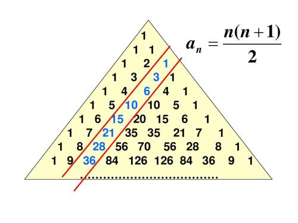
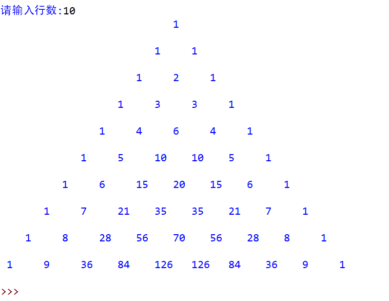

# 杨辉三角程序介绍

## 杨辉三角介绍
杨辉三角，是二项式系数在三角形中的一种几何排列。在欧洲，这个表叫做帕斯卡三角形。帕斯卡（1623----1662）是在1654年发现这一规律的，比杨辉要迟393年，比贾宪迟600年。杨辉三角是中国古代数学的杰出研究成果之一，它把二项式系数图形化，把组合数内在的一些代数性质直观地从图形中体现出来，是一种离散型的数与形的结合。  
## 链接
这是一个杨辉三角介绍的[链接](https://baike.baidu.com/item/%E6%9D%A8%E8%BE%89%E4%B8%89%E8%A7%92/215098?fr=aladdin)




## 程序原理
通过创建动态二维列表，利用杨辉三角数学规律赋值，再逐项输出，得到需要行数的杨辉三角。

## 具体程序介绍

### 赋值部分 
 
## code

```python
i = 0
j = 0
a = [[0] * guess for i in range(guess)]

while i < guess:
    if i == 0:
        a[0][0]=1
    else:
        for j in range(i+1):
            a[i][0]=1
            if j > 0:
                a[i][j] = a[i-1][j] + a[i-1][j-1]
            j=j+1
    i=i+1
```


### 输出部分

## code

```python
k=0
j=0
for k in range(guess):
    print(" "*(3*(guess-k)-2),end="")
    for j in range(k+1):
        print(a[k][j],end="")
        if a[k][j]<10:
          print("     ",end="")
        if a[k][j]>9 and a[k][j]<100:
          print("    ",end="")
        if a[k][j]>99:
          print("   ",end="")
        j=j+1
    print("\n")
```
## 程序应用注意

由于再输出列表时，输出结果的数位会影响输出图形的形状，本程序只适用于输出包含数字最大值不超过1000的杨辉三角。

程序截图


